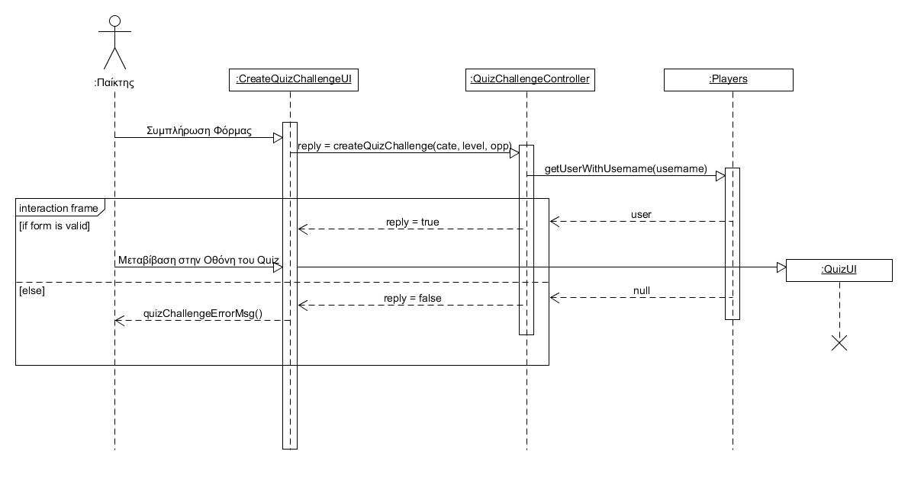

# Εισαγωγή
---
Σε αυτό το έγγραφο θα βρείτε το διάγραμμα κλάσεων που περιγράφει την στατική όψη της λογικής του πεδίου του προβλήματος μας. Το διάγραμμα περιλαμβάνει τις απαραίτητες κλάσεις που χρειάζονται για την δημιουργία και εγγραφή ενός παίκτη καθώς και κατάλληλες κλάσεις για την δημιουργία και χειρισμό των Quiz. Επίσης θα βρείτε και τα διαγράμματα ακολουθίας τα οποία περιγράφουν την δυναμική όψη της λογικής του πεδίου για τις σημαντικότερες περιπτώσεις χρήσης που είναι η ΠΧ για την εγγραφή, για την δημιουργία πρόκλησης, και την απάντηση πρόκλησης.

## Διάγραμμα Κλάσεων

Κάθε κλαση περιλαμβάνει τις κατάλληλες μεθόδους που χρειάζονται. Κάθε μέθοδος έιναι της μορφής name(arg: arg_type): return_type, στο πεδίο name βάζουμε το όνομα της μεθόδου, μέσα στην παρένθεση δηλώνουμε τις παραμέτρους, όπου arg έιναι το όνομα της παραμέτρου και arg_type ο τύπος της παραμέτρου, τέλος στο πεδίο return_type βάζουμε τον τύπου του αντικειμένου που επιστρέφουμε, ο τύπος έιναι κενός αν δεν επιστρέφουμε κάτι.

## Διαγράμματα Ακολουθίας
Παρακάτω θα δείτε τα διαγράμματα ακολουθίας για την εγγραφή, για την δημιουργία πρόκλησης, και την απάντηση πρόκλησης.

#### Εγγραφή

#### Δημιουργία Πρόκλησης

#### Aπάντηση Πρόκλησης

