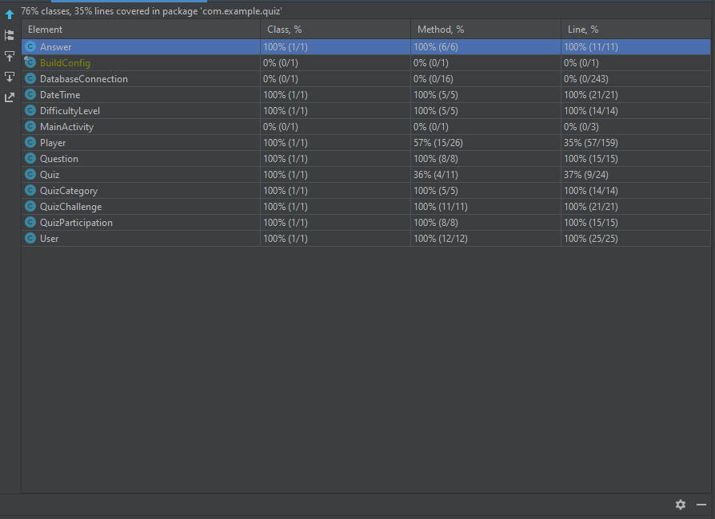

Έγιναν test στις κλάσεις AnswerTest, DatatimeTest, DifficultyLevelTest, ExampleUnitTest, PlayerTest, QuestionTest, QuizCategoryTest, QuizChallengeTest, QuizParticipationTest, QuizTest, UserTest.Παρακάτω φαίνεται το συνολικό ποσοστό κώδικα
που καλύπτουν.

Συγκεκριμένα, οι κλάσεις καλύπτουν 76% του κώδικα και οι μέθοδοι 68% αυτού. Τα test έγινα κυρίως σε μεθόδους get/set των κλάσεων καθώς και σε μεθόδους που δεν ήταν απαραίτητη η χρήση κάποιου server.

