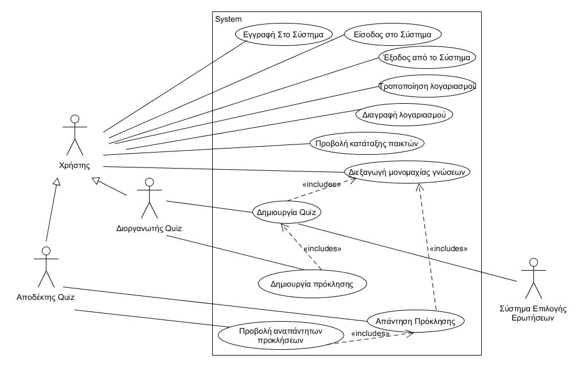
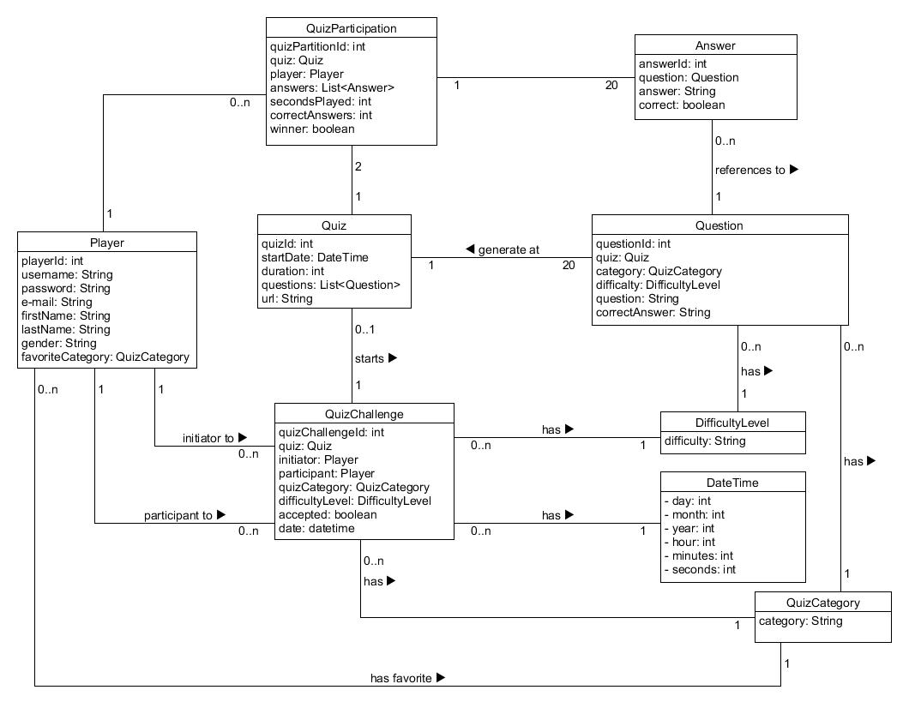
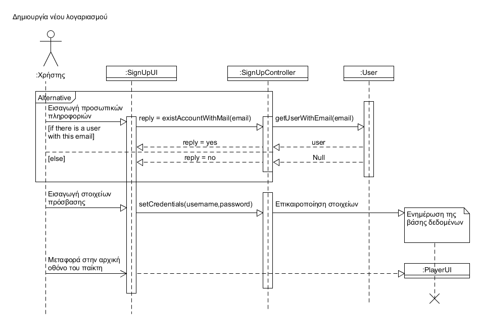
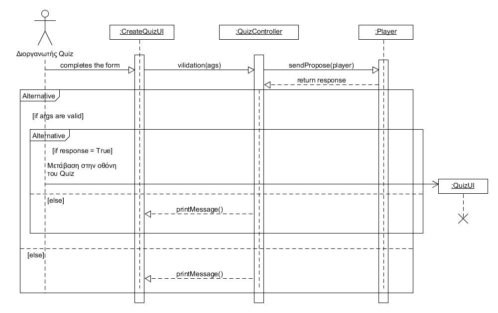
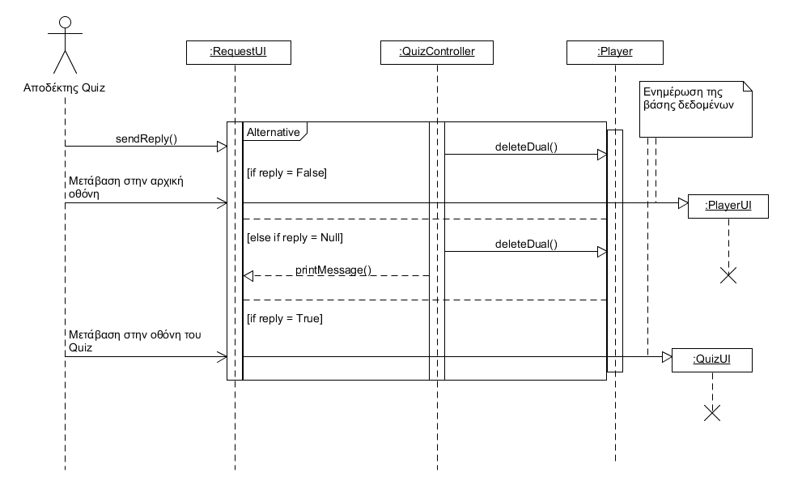

## Εισαγωγή
---
Στο παρόν έγγραφο θα δείτε τις Περιπτώσεις Χρήσης μια προς μια (θα υπάρχουν αντίστοιχα hyperlinks που οδηγούν στην αναλυτική περιγραφή των περιπτώσεων χρήσης). Θα δείτε επίσης συμπληρωματικές προδιαγραφές του συστήματος (Απαιτήσεις διεπαφών, Ποιοτικά χαρακτηριστικά κλπ.) και τέλος οι κλάσεις ανάλυσης καθώς και τα sequence diagrams για μερικές περιπτώσεις χρήσης. Σκοπός του εγγράφου είναι η κατανόηση της δομής και της ροής των δεδομένων του προγράμματος για την εγγραφή του χρήστη στο σύστημα, την είσοδο του στο σύστημα καθώς και την δημιουργία Quiz και αποδοχής αντίστοιχα ενός Quiz.

### Ορισμοί ακρώνυμα και συντομογραφίες
 - Λέξη: Περίπτωση Χρήσης, Συντομογραφία: ΠΧ

### Επισκόπηση
Το έγγραφο είναι οργανωμένο σε 3 βασικές ενότητες. Η πρώτη ενότητα είναι Συνολική περιγραφή, στην οποία θα έχοθμε το διάγραμμα Περιπτώσεων Χρήσης. Ακολουθή η δεύτερη ενότητα η οποία είναι οι Ειδικές Απαιτήσεις, στην ενότητα αυτή θα δούμε αναλυτικά τις Περιπτώσεις χρήσης, δηλαδή τους ενδιαφερόμενους, τους actors καθώς και επίσης τις περιγραφές των περιπτώσεων χρήσης, ύστερα θα ακολουθήσουν Συμπληρωματικές προδιαγραφές για το σύστημα μας. Η τρίτη ενότητα είναι το Υποστηρικτικό υλικό, στην οποία θα έχουμε το Μοντέλο πεδίου, τις Κλάσεις ανάλυσης και τις Συμπεριφορές (Sequence Diagrams).

## Συνολική Περιγραφή
---
### Επισκόπηση μοντέλου περιπτώσεων χρήσης

#### Σύντομή Περιγραφή Περιπτώσεων Χρήσης
[Περιγραφή Περιπτώσεων Χρήσης](use-case-model.md)

## Ειδικές Απαιτήσεις
---
### Οι ενδιαφερόμενοι και οι ανάγκες τους
    1. Χρήστης
    - Θέλει να κάνει εγγραφή στην εφαρμογή για να συμμετέχει.
    - θέλει να πραγματοποιήσει σύνδεση στην εφαρμογή.
    - θέλει να λάβει μέρος σε μία μονομαχία γνώσεων.
    - θέλει να ενημερωθεί για την κατάταξη του.
    2. Διοργανωτής Quiz
    - θέλει να δημιουργήσει ένα νέο Quiz.
    - Θέλει να λάβει απάντηση απο τον αποδέκτη.
    3. Αποδέκτης
    - Θέλει να δέχεται προκλήσεις Quiz.
### Actors του συστήματος
    - Χρήστης
    - Διοργανωτής Quiz
    - Αποδέκτης
### Περιγραφές περιπτώσεων χρήσης
[ΠΧ1. Εγγραφή στο σύστημα](use-case-register.md)

[ΠΧ2. Είσοδος στο σύστημα](user-case-login.md)

[ΠΧ3. Δημιουργία Quiz](use-case-create-quiz.md)

[ΠΧ4. Απάντηση Πρόκλησης](use-case-response.md)

[ΠΧ5. Προβολή Κατάταξης Παικτών](use-case-rankings.md)

[ΠΧ6. Διεξαγωγή Μονομαχίας Γνώσεων](use-case-dual.md)

### Συμπληρωματικές προδιαγραφές

#### Ποιοτικά χαρακτηριστικά
##### Eπίδοση
 - Η εφαρμογή δίνει τη δυνατότητα απομνημόνευσης κωδικού, ώστε να μην αναγκάζεται ο χρήστης κάθε φορά να δίνει τα στοιχεία πρόσβασής του.
 - Ο παίκτης έχει τη δυνατότητα να επιλέξει κάποιον αντίπαλο έχοντας την εγγύηση ότι βρίσκεται online ώστε να μην περιμένει άσκοπα.
##### Ευχρηστία
 - Η κατάταξη όλων των παικτών σε κατηγορία και επίπεδο δυσκολίας διεγείρει το ενδιαφέρον του
παίκτη, ο οποίος θα αφιερώσει πολλές ώρες παίζοντας ώστε να ανέβει στο ranking. 
 - Ο παίκτης έχει δυνατότητα επιλογής σε ποια μονομαχία θέλει να συμμετέχει, καθώς γνωρίζει από πριν την κατηγορία και το επίπεδο των ερωτήσεων.
 - Υπάρχει η δυνατότητα πρόκλησης παικτών μέσω του πίνακα κατάταξης. Έτσι ο παίκτης μπορεί να διαλέξει αυτούς που είναι στο ίδιο επίπεδο με αυτόν ή σε χαμηλότερο
##### Ευελιξία
 - Ο χρήστης σε περίπτωση που ξεχάσει τα στοιχεία πρόσβασης, μπορεί να τα ανακτήσει μέσω του email του. 
 - Ο χρήστης έχει τη δυνατότητα να διαγράψει τον λογαριασμό του εφόσον το 

## Υποστηρικτικό υλικό

### Συμπεριφορές

##### Άνοιγμα Νέου Λογαριασμού

##### Δημιουργία Quiz

##### Απάντηση Πρόκλησης

