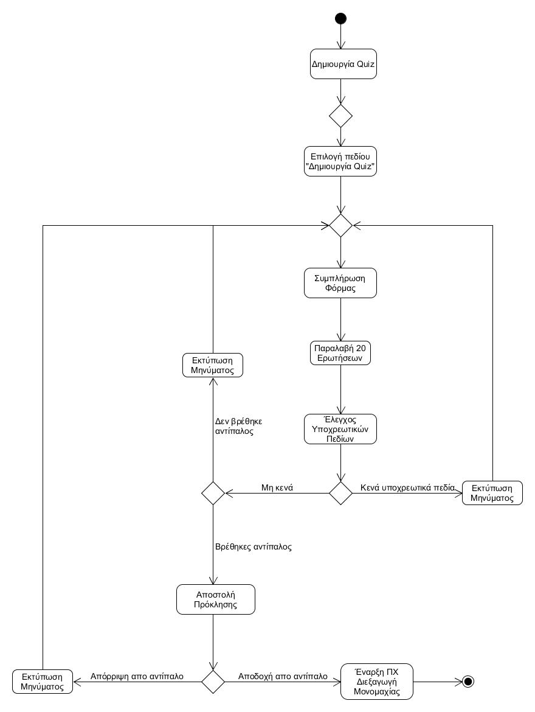

 # ΠΧ3. Δημιουργία Quiz
 ---
__Πρωτεύων Actor:__ Διοργανωτής Quiz

__Ενδιαφερόμενοι:__
- __Διοργανωτής Quiz:__ θέλει να δημιουργήσει ένα νέο Quiz.

__Προϋποθέσεις:__ Ο διοργανωτής έχει συνδεθεί επιτυχώς στο λογαριασμό του.

### Βασική Ροή
---
##### Α) Δημιουργία νέου Quiz
1. Ο χρήστης επιλέγει το πεδίο "Δημιουργία Quiz".
2. Το σύστημα του εμφανίζει τη φόρμα (κατηγορία και επίπεδο δυσκολίας των ερωτήσεων, αντίπαλο) δημιουργίας νέου quiz.
3. Ο χρήστης συμπληρώνει τη φόρμα (κατηγορία και επίπεδο δυσκολίας των ερωτήσεων, αντίπαλο).
4. Το σύστημα ζητάει από το Trivia API ένα σύνολο 20 ερωτήσεων με βάση τη φόρμα που συμπλήρωσε ο χρήστης.
5. Το σύστημα ενημερώνει τον χρήστη για την επιτυχή δημιουργία του quiz.
6. Το σύστημα στέλνει την πρόκληση στον αποδέκτη.
7. Ο διοργανωτής ενημερώνεται για την αποδοχή της πρόκλησης.
8. Το σύστημα ξεκινά την περίπτωση χρήσης ["Διεξαγωγή Μονομαχίας"](use-case-dual.md).

__Εναλλακτικές Ροές__
5α. Δεν έχει γίνει εισαγωγή κάποιου από τα υποχρεωτικά πεδία(κατηγορία και επίπεδο δυσκολίας των ερωτήσεων, αντίπαλο)
1. Το σύστημα εμφανίζει κατάλληλο μήνυμα σφάλματος.
2. Η ΠΧ επιστρέφει στο βήμα 3 της βασικής ροής.

5β. Ο αντίπαλος δεν βρέθηκε.
1. Το σύστημα εμφανίζει κατάλληλο μήνυμα σφάλματος.
2. Η ΠΧ επιστρέφει στο βήμα 3 της βασικής ροής.

6α. Ο αντίπαλος απέρριψε την πρόκληση.
1. Το σύστημα εμφανίζει κατάλληλο μήνυμα σφάλματος.
2. Η ΠΧ επιστρέφει στο βήμα 3 της βασικής ροής.

### Διαγράμματα
---
##### Διάγραμμα δραστηριότητας - Δημιουργία νέου Quiz

