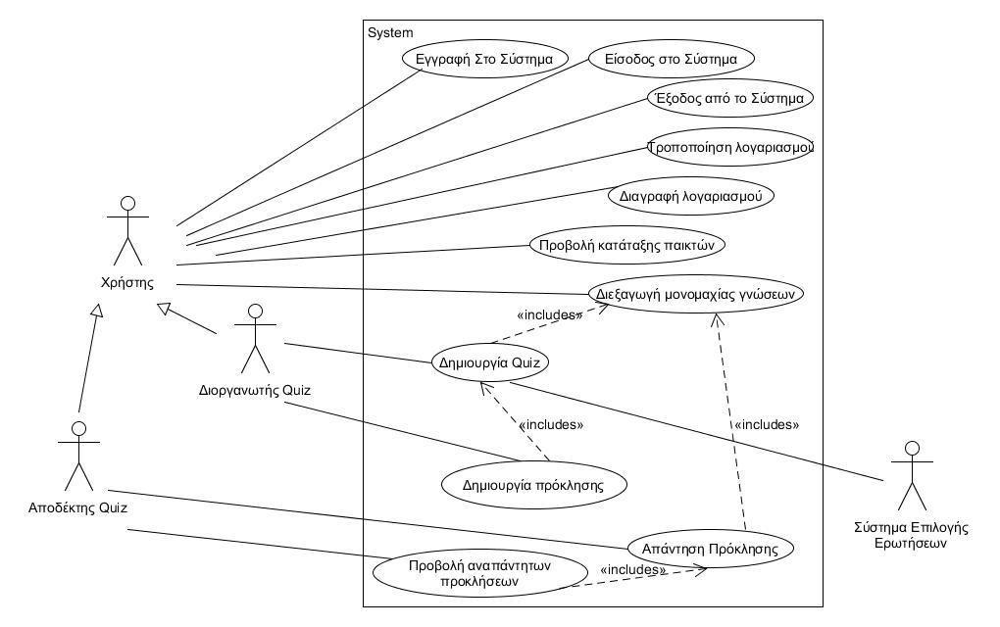

 # Σύντομη Περιγραφή Περιπτώσεων Χρήσης
   
 - Εγγραφή στο σύστημα: Για την εγγραφή του στο σύστημα ο χρήστης συμπληρώνει τα προσωπικά του στοιχεία, όπως όνομα, επώνυμο, φύλλο, αγαπημένη κατηγορία, καθώς και τα στοιχεία πρόσβασής του, δηλαδή username και password.
 - Σύνδεση στο σύστημα: Κατά την σύνδεσή του στο σύστημα ο χρήστης καλείται να εισάγει username και password. Ο χρήστης επίσης έχει την δυνατότητα επαναφοράς κωδικού πρόσβασης εάν το ξέχασε.
 - Δημιουργία Quiz: Κατά την δημιουργία του quiz ο διοργανωτής καλείται να επιλέξει κατηγορία και επίπεδο δυσκολίας των ερωτήσεων, καθώς και τον αποδέκτη του quiz (αντίπαλο). Μόλις ο αντίπαλος αποδεχθεί την πρόκληση το παιχνίδι ξεκινά.
 - Απάντηση πρόκλησης: Ο χρήστης ο οποίος προκαλείται σε μονομαχία αποδέχεται την πρόκληση και ξεκινάει το παιχνίδι. Έχει επίσης την δυνατότητα απόρριψης της μονομαχίας γνώσεων.
 - Διεξαγωγή Μονομαχίας γνώσεων: Στην αρχή του παιχνιδιου θα εμφανίζονται 20 ερωτήσεις πολλαπλής επιλογής, ίδιες για κάθε παίκτη, από μια συγκεκριμένη κατηγορία ερωτήσεων και με συγκεκριμένο επίπεδο δυσκολίας. Μόλις και οι δύο παίκτες απαντήσουν στις ερωτήσεις θα τους ανακοινώνεται ο νικητής. Κατόπιν το Quiz τελειώνει.
 - Προβολή Κατάταξης Παικτών: Το σύστημα θα εμφανίζει λίστες κατάταξης των παικτών με τις μεγαλύτερες επιδόσεις ανά κατηγορία ερωτήσεων και επίπεδο δυσκολίας. Οπότε κάθε παίχτης έχει δυνατότητα προβολής της λίστα που θέλει.
  
 
## Διάγραμμα περιπτώσεων Χρήσης
 
