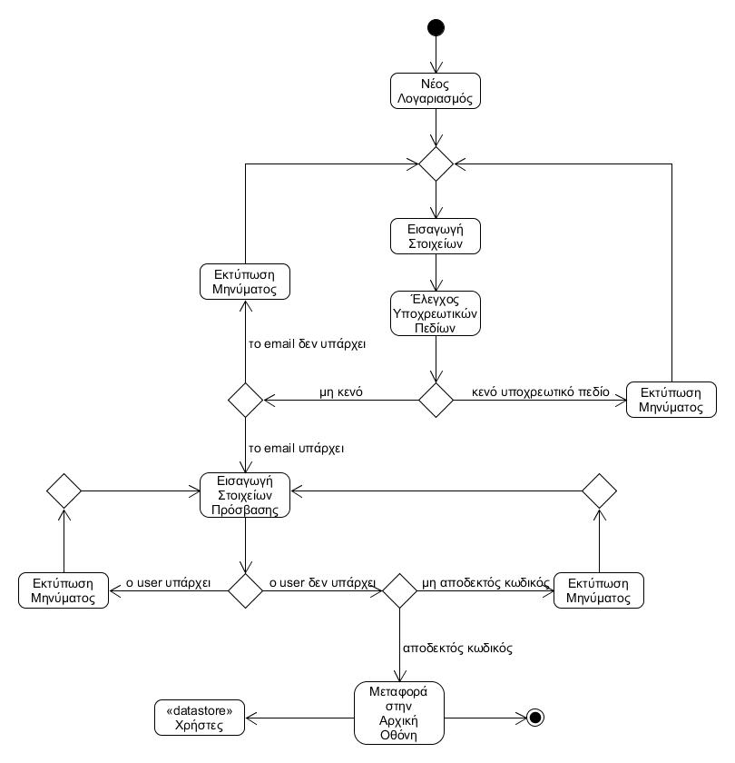
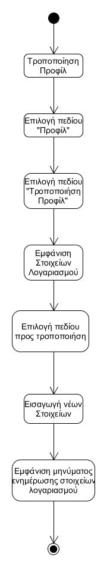
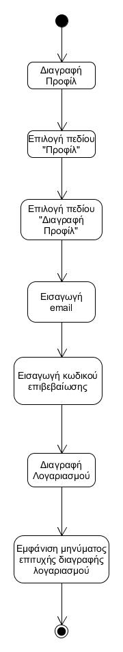

 # ΠΧ1. Εγγραφή στο σύστημα
 ---
__Πρωτεύων Actor:__ Χρήστης

__Ενδιαφερόμενοι:__
- __Χρήστης:__ Θέλει να κάνει εγγραφή στην εφαρμογή για να συμμετέχει.

### Βασική Ροή
---
##### Α) Δημιουργία λογαριασμού
1. Ο χρήστης εισάγει τα στοιχεία λογαριασμού (όνομα, επώνυμο, φύλλο, email, αγαπημένη κατηγορία).
2. Το σύστημα αποθηκεύει τα στοιχεία λογαριασμού και ζητάει από τον χρήστη να εισάγει τα στοιχεία πρόσβασης.
3. Ο χρήστης εισάγει τα στοιχεία πρόσβασης (username και password).
4. Το σύστημα ενημερώνει τον χρήστη για την επιτυχή δημιουργία του λογαριασμού του.
5. Το σύστημα μεταφέρει τον χρήστη στην αρχική οθόνη.

__Εναλλακτικές Ροές__
2α. Δεν έχει γλινει εισαγωγή κάποιου από τα υποχρεωτικά πεδία (email).
1. Το σύστημα εμφανίζει κατάλληλο μήνυμα σφάλματος.
2. Η ΠΧ επιστρέφει στο βήμα 1 της βασικής ροής.

2β. Υπάρχει λογαριασμός με το ίδιο email.
1. Το σύστημα εμφανίζει κατάλληλο μήνυμα σφάλματος.
2. Η ΠΧ επιστρέφει στο βήμα 1 της βασικής ροής.

4α. Υπάρχει λογαριασμός με το ίδιο username.
1. Το σύστημα εμφανίζει κατάλληλο μήνυμα σφάλματος.
2. Η ΠΧ επιστρέφει στο βήμα 3 της βασικής ροής.

4β. Ο κωδικός πρόσβασης δεν είναι αποδεκτός (κενό πεδίο, πλήθος χαρακτήρων μικρότερο του 5).
1. Το σύστημα εμφανίζει κατάλληλο μήνυμα σφάλματος.
2. Η ΠΧ επιστρέφει στο βήμα 3 της βασικής ροής.

##### Β) Τροποποίηση προφίλ
1. Ο χρήστης επιλέγει το πεδίο "Προφίλ".
2. Ο χρήστης επιλέγει το πεδίο "Τροποποίηση προφίλ".
3. Το σύστημα εμφανίζει στον χρήστη τα στοιχεία που έδωσε κατά την εγγραφή.
4. Ο χρήστης επιλέγει το πεδίο που θέλει να τροποποιήσει (όνομα, επώνυμο, φύλλο, αγαπημένη κατηγορία).
5. Ο χρήστης τροποποιεί το επιλεγμένο πεδίο.
6. Το σύστημα ενημερώνει τα στοιχεία λογαριασμού του χρήστη.

##### Γ) Διαγραφή προφίλ
1. Ο χρήστης επιλέγει το πεδίο "Προφίλ".
2. Ο χρήστης επιλέγει το πεδίο "Διαγραφή προφίλ".
3. Το σύστημα ζητά από τον χρήστη την εισαγωγεί του email του.
4. Ο χρήστης εισάγει το email του.
5. Το σύστημα ζητά τον κωδικό επιβεβαίωσης που έλαβε ο χρήστης.
6. Ο χρήστης εισάγει τον κωδικό επιβεβαίωσης.
7. Το σύστημα διαγράφει το λογαριασμό του χρήστη.
8. Το σύστημα ενημερώνει τον χρήστη για την επιτυχή διαγραφή του λογαριασμού του.

### Διαγράμματα
---
##### Διάγραμμα δραστηριότητας - Δημιουργία νέου λογαριασμού

##### Διάγραμμα δραστηριότητας - Τροποποίηση προφιλ

##### Διάγραμμα δραστηριότητας - Διαγραφή προφίλ

