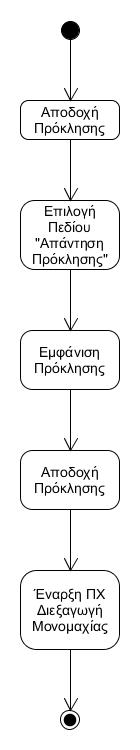
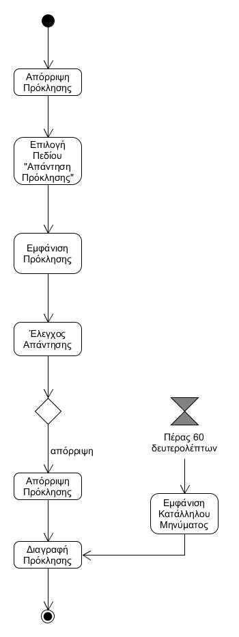

# ΠΧ4. Απάντηση Πρόκλησης
---
__Πρωτεύων Actor:__ Αποδέκτης

__Ενδιαφερόμενοι:__
- __Αποδέκτης:__ Θέλει να δέχεται προκλήσεις Quiz.
- __Διοργανωτής:__ Θέλει να λάβει απάντηση απο τον αποδέκτη.

__Προϋποθέσεις:__
- Ο αποδέκτης έχει συνδεθεί επιτυχώς.
- Ο αποδέκτης έχει λάβει τουλάχιστον 1 Quiz.

### Βασική Ροή
---
##### Α) Αποδοχή Πρόκλησης 
1. Ο αποδέκτης επιλέγει το πεδίο "Απάντηση Πρόκλησης".
2. Το σύστημα εμφανίζει την πρόκληση που έχει λάβει.
3. Ο αποδέκτης αποδέχεται την πρόκληση.
4. Το σύστημα ξεκινά την περίπτωση χρήσης ["Διεξαγωγή Μονομαχίας"](use-case-dual.md).

##### B) Απόρριψη Πρόκλησης 
1. Ο αποδέκτης επιλέγει το πεδίο "Απάντηση Πρόκλησης".
2. Το σύστημα εμφανίζει την πρόκληση που έχει λάβει.
3. Ο αποδέκτης αρνείται την πρόκληση.
4. Το σύστημα διαγράφει την πρόκληση.
5. Η ΠΧ τερματίζει.

__Εναλλακτικές Ροές__
3α. Ο αποδέκτης δεν απάντησε εντός χρονικού ορίου (1 λεπτό).
1. Το σύστημα εμφανίζει κατάλληλο μήνυμα.
2. Το σύστημα διαγράφει την πρόκληση.
3. Η ΠΧ επιστρέφει στο βήμα 4 της βασικής ροής.

### Διαγράμματα
---
#### Διάγραμμα Δραστηριότητας - Αποδοχή Πρόκλησης

#### Διάγραμμα Δραστηριότητας - Απόρριψη Πρόκλησης

